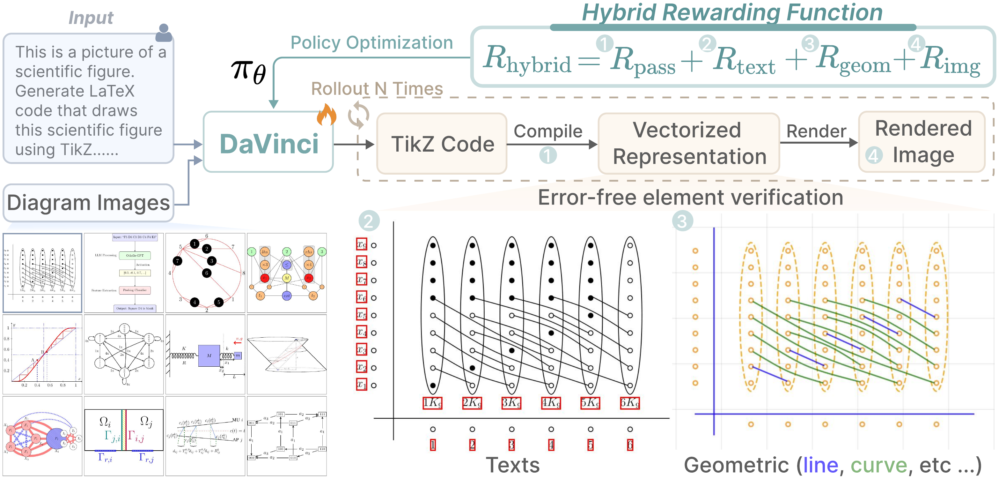
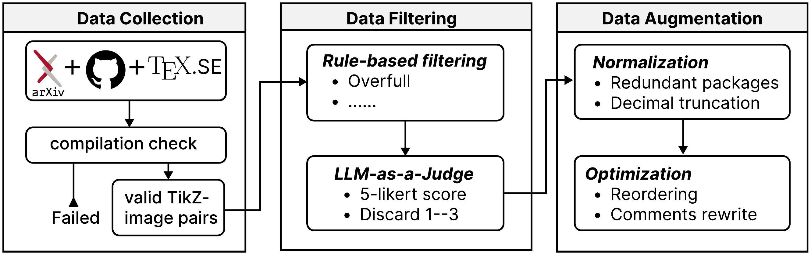

# DaVinci: Reinforcing Visual-Structural Syntax in MLLMs for Generalized Scientific Diagram Parsing

Xingchen Zeng, Zhewei Su, Hengming Zhang, Juyong Jiang, Jiazhi Xia, Wei Zeng

ICLR 2026 · [Paper](https://openreview.net/pdf?id=OAXECnLxuk) · [Dataset](https://huggingface.co/datasets/lewy666/TikZ30K) · [Model](https://huggingface.co/lewy666/DaVinci-CommunityV)
<div> 

</div>

---

## About this repository

This repository hosts the **data engine and preprocessing tools** behind
*DaVinci*, a two-stage (SFT + RL) multimodal LLM that converts raster
scientific diagrams back into structured, editable TikZ source code.
We release the tools that built the **TikZ30K** training corpus so the
community can reproduce, extend, or adapt the dataset construction to
other diagram-to-code domains.

---

## Data pipeline

<div align="center">

</div>

The pipeline turns a raw corpus of `(image, code)` TikZ pairs into the
clean, normalized, annotated **TikZ30K** dataset in four stages:

```
Diagram-to-TikZCode/
├── tikz_import_optimization/   Stand-alone tool: iteratively prune
│                               redundant \usepackage / \usetikzlibrary
│                               declarations by repeated compilation.
│
├── data_engine/                Four-stage parquet-in / parquet-out
│                               pipeline used to build TikZ30K:
│                                 filtering/   blacklist / density / log scan
│                                 normalize/   LLM reorder + comment
│                                 render/      LaTeX -> PNG
│                                 annotation/  VLM classify + rate
│
├── train/                      RL training stage:
│                                 reward_function/reward.py
│                                 dreamsim / pdf_text / geometry workers
│                                 train.sh + prompt template
│
└── eval/                       Image-to-TikZ evaluation:
                                  qwenvl_infer.py   vLLM batched inference
                                  run_eval.py       text + image metrics
```

| Module | What it does | Read more |
|---|---|---|
| [`tikz_import_optimization/`](./tikz_import_optimization) | Compile-driven minimization of TikZ preambles. | [README](./tikz_import_optimization/README.md) |
| [`data_engine/`](./data_engine) | Full dataset construction pipeline. | [README](./data_engine/README.md) |
| [`train/`](./train) | RL reward (MSE + DSIM + PDF layout IoU + geometry) and training launcher. | [README](./train/README.md) |
| [`eval/`](./eval) | Inference + 10-metric scoring suite. | [README](./eval/README.md) |

Each module ships with its own setup instructions and usage examples.

---

## Citation

```bibtex
@inproceedings{zeng2026davinci,
  title     = {Da{V}inci: Reinforcing Visual-Structural Syntax in {MLLM}s for Generalized Scientific Diagram Parsing},
  author    = {Zeng, Xingchen and Su, Zhewei and Zhang, Hengming and
               Jiang, Juyong and Xia, Jiazhi and Zeng, Wei},
  booktitle = {The Fourteenth International Conference on Learning
               Representations (ICLR)},
  year      = {2026},
  url       = {https://openreview.net/pdf?id=OAXECnLxuk}
}
```


## Acknowledgements

This work would not have been possible without the prior efforts of the
TikZ-to-code community. In particular, we are deeply grateful to:

- [**DeTikZify**](https://github.com/potamides/DeTikZify) — for
  pioneering MLLM-based diagram-to-TikZ synthesis.
- [**DaTikZ / DaTikZv2 / DaTikZv3**](https://github.com/potamides/DaTikZ) —
  large-scale TikZ datasets whose data crawling informed TikZ30K.
  

We also thank the open-source projects we build on, in particular
[LLaMA-Factory](https://github.com/hiyouga/LLaMA-Factory),
[EasyR1](https://github.com/hiyouga/EasyR1), and the broader
TikZ / PGFPlots community.
